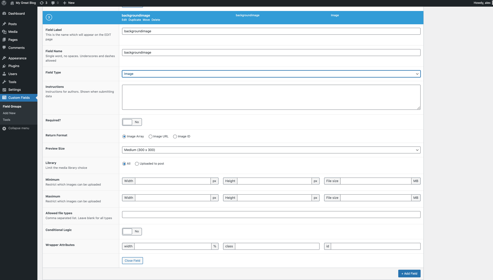

### Advanced Custom Fields

Denna text är baserad på 

https://youtube.com/playlist?list=PLgFB6lmeXFOoyP8YUj7TmDnzFrrPcjCf3

och temat ni kan använda er av finns att ladda ned på:

https://drive.google.com/file/d/1nYg57UUQikRi9CSkcs2j1-DuxMMw34Dh/view

Som utvecklare är vi inte dummare än att vi försöker hitta verktyg som gör livet så enkelt för oss som möjligt. 

Advanced Custom Fields är ett sådant verktyg.

https://www.advancedcustomfields.com/

ACF låter en lägga till extra fields när vi skapar en hemsida.

**1**

Börja med installera följande plugins


**2**

Du kan lägga till extra fields på vilken sida du än vill, men låt oss börja med frontpage. Efter att du har lagt till **Home** och satt den som frontpage, väljer du **Add new** på **Custom Fields**.


Välj namn på gruppen och bestämm var någonstan, på vilken sida, den ska synas.

**3**

Tryck **+ Add Field**.

Här kan du bestämma dina fields. Till exemle **title**, **subtitle** och **backgroundimage**


Tryck på publish och gå till **home**.


**5**

Nu är tanken att vi i vårt custom theme ska kunna displaya denna informationen.

Och det gör vi genom

```
<?php
$title = get_field('page_title');
OBS! Råkar du istället för get_field() skriva the_field() så kommer du att slösa bort 1 timma av din dag.


if($title) {
    echo $title;
}
```

Gå nu tillbaks till Admin så ska vi se vilka flera typer av data vi kan arbeta med.

Tryck **+ Add fields** igen och lägg till




Lägg till infon i **Home**.

Nu tillbaks till vår code editor.

**textarea**

För att lägga till vår **description**(Textarea);

```
$description = get_field('description');
```

```
 if($description): ?>
        <p><?php echo nl2br($description); ?></>
        <?php endif;  ?>
```

nl2br är en php-funktion som gör som

"Insert line breaks where newlines (\n) occur in the string:"

```
<?php
echo nl2br("One line.\nAnother line.");
?>
```

```
One line.
Another line.
```

**image**

```
$image = $getImage['sizes']['large'];
```

kör

```
var_dump(get_field($background));
```

så ser ni att vi har fått tillbaka en array. Ur den väljer vi sizes:large

```
" class="img-fluid">
```

#### Repeated fields

