### Skapa ett WordPress-projekt

**1**

Börja med att öppna MAMP. Tryck på **+** för att skapa ett nytt projekt.

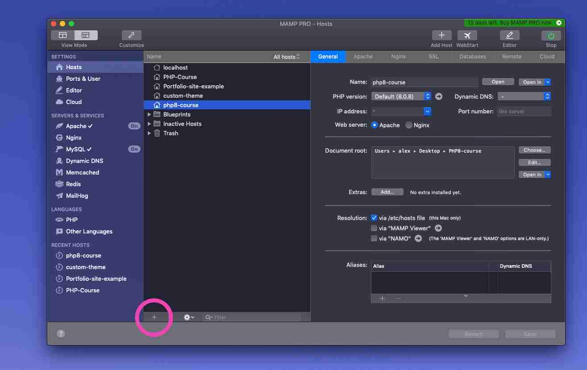

**2**

Välj **WordPress** som "Host Type"

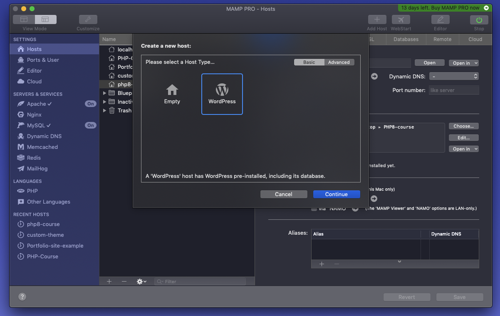

**3**

Välj **Document root** ditt projektets filer kommer leva.

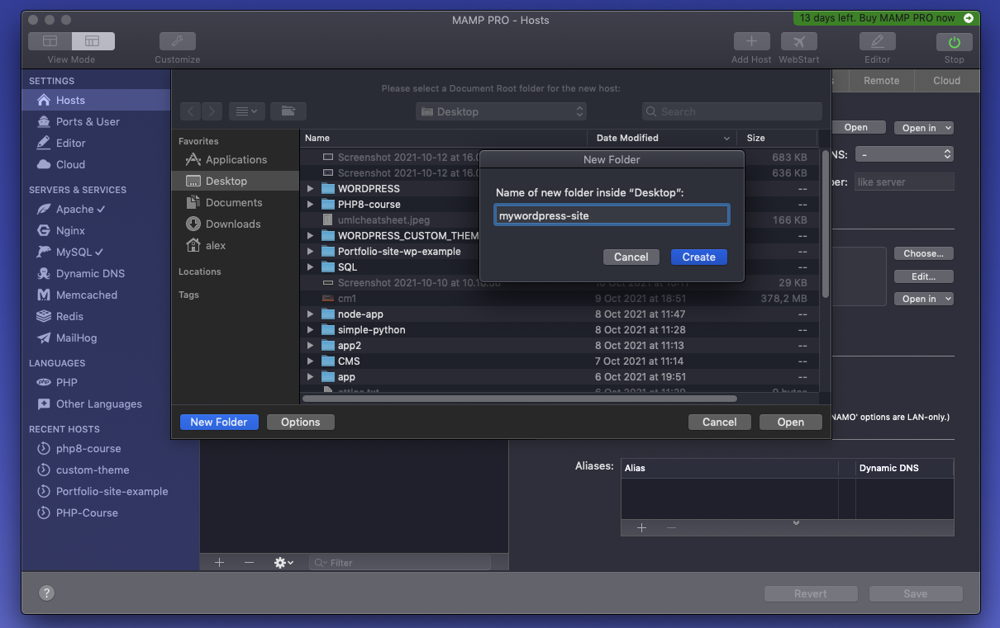

**4**

Välj **Admin name**, **Admin Password** och skriv in din **email**. Vid händelse av att du behöver skriva in övrig information själv, gör då så.

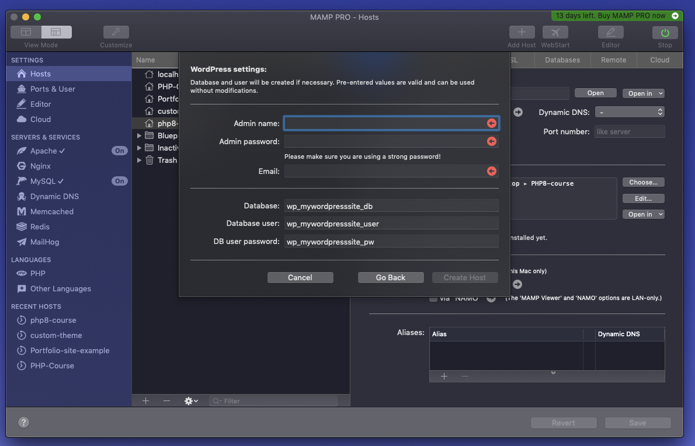

**5**

Tryck nu på **open**

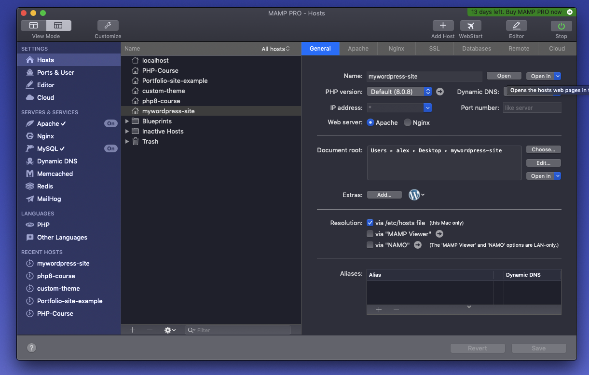

**6**

Du har nu skapat dig en WordPress-sida!

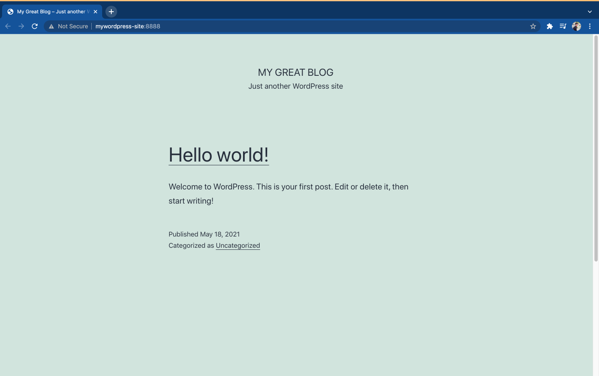

**7**

Gå in på **/wp-admin** (i mitt fall mywordpress-site:8888/wp-admin) och skriv in de uppgifter du angav i steg 4. Du befinner dig nu inne i **Admin**.

Låt oss börja med att utforska **Admin Area**.

Menyn till vänster kallas för **The Admin Menu**. Den innehåller länkar till varje administrativ feature i WordPress.

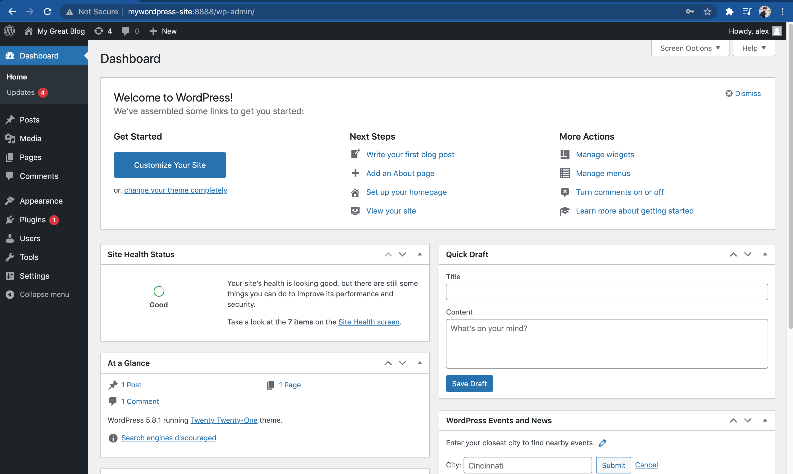

**8**

Hover över **Settings** och tryck på **General**

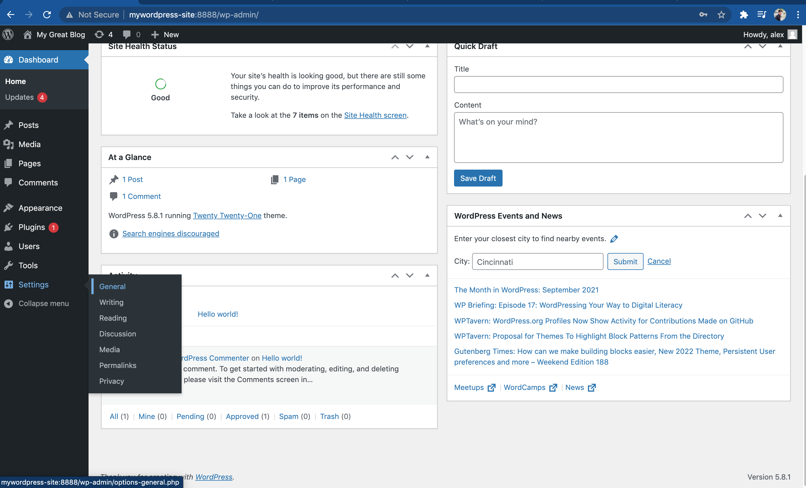

Ändra på **Site Title** och **Tagline**

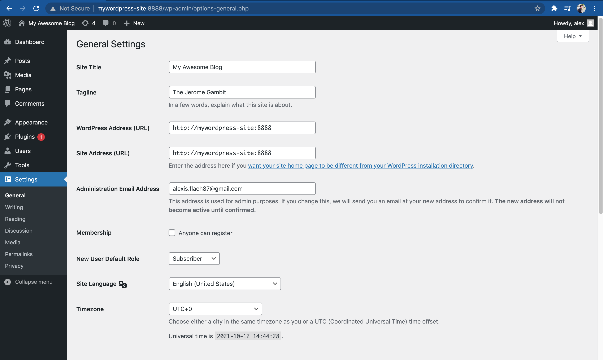

Gå längst upp till vänster och tryck på **Visit Site**.

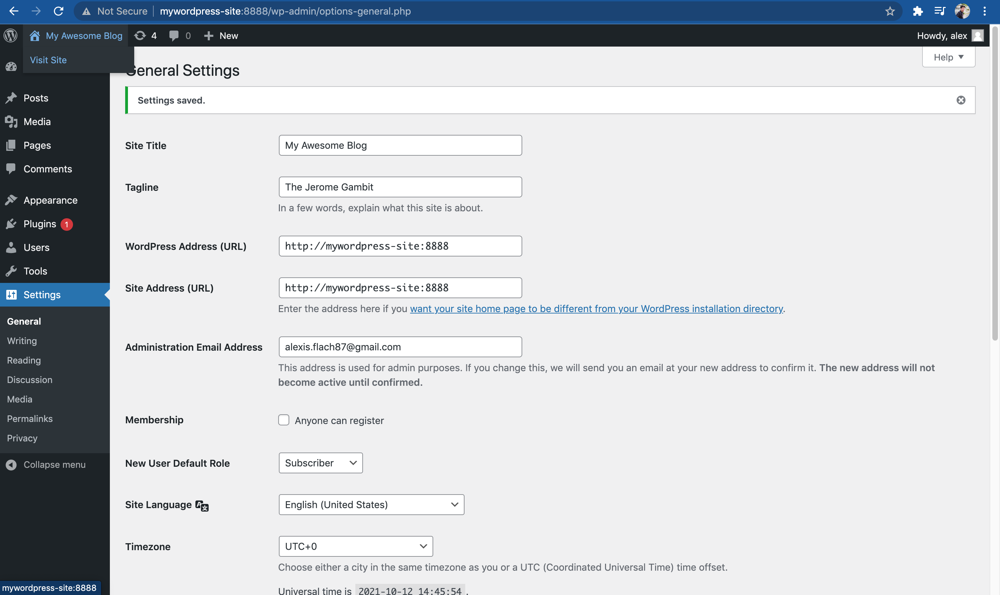

Vi kan nu se att vår förstasida har ändrats till de förändring vi gjorde.

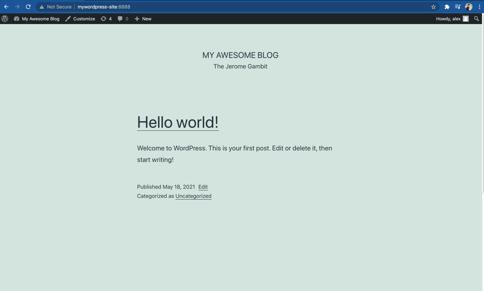

Gå tillbaks till **Admin** genom att trycka på **My Awesome Blog** längst upp till höger.

**9**

Klicka på **appearence** i Admin Menyn och välj **Themes**.

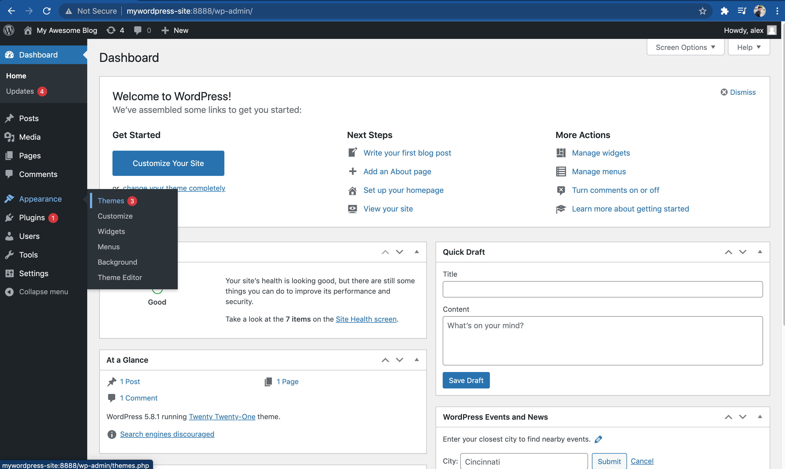

Aktivera **Twenty Nineteen**

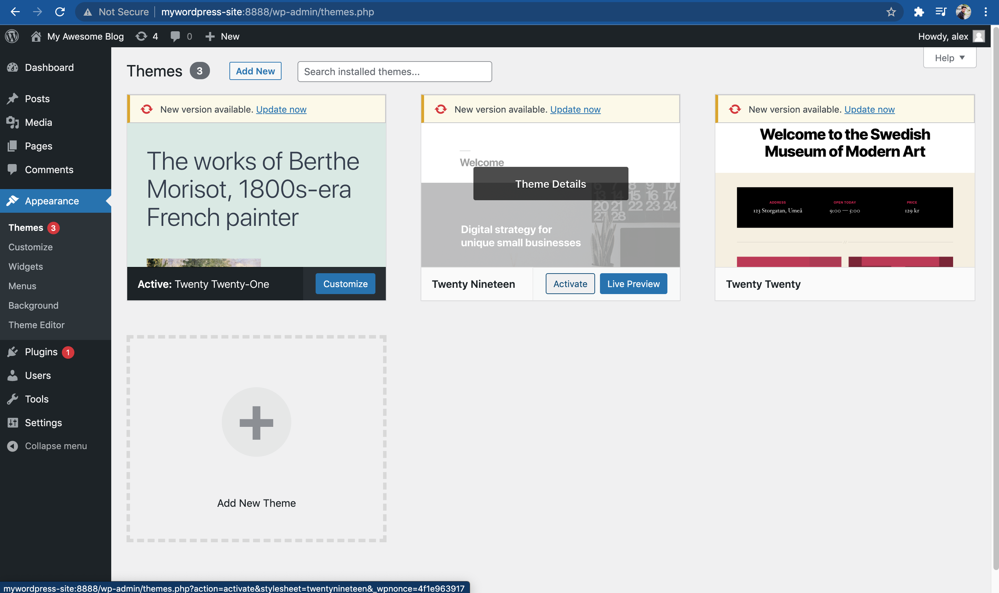

Vi kan nu se hur layouten på vår hemsida har ändrats.

Senare i kursen kommer vi att skapa våra egna teman.

På förstasida syna ett inlägg med titel "Hello World". Vi kan snabbt och enkelt skapa egna inlägg, vilket är en av de stora fördelarna med att använda sig av ett CMS.

Gå tillbaks till **Admin**.

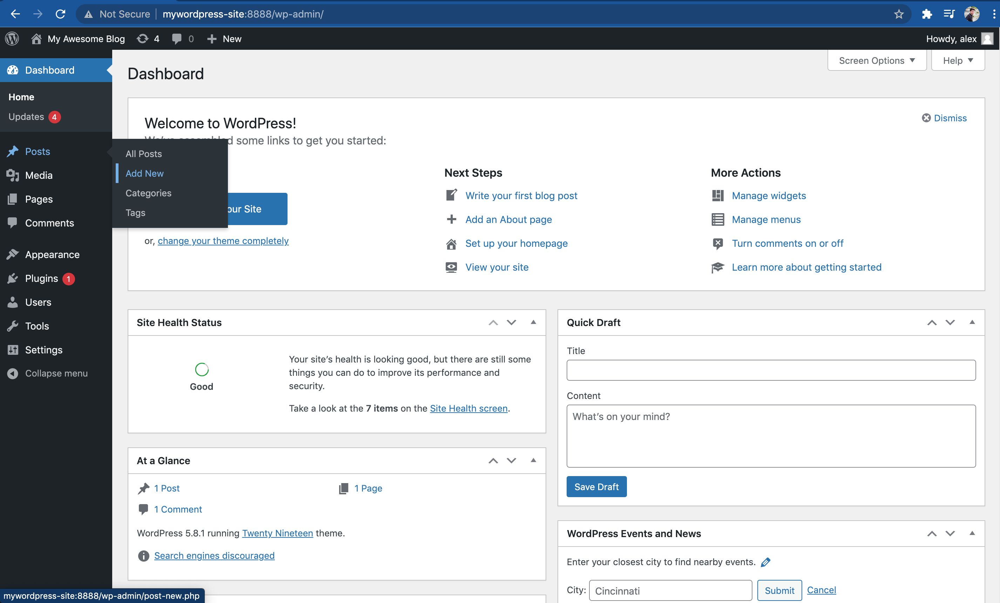

Skriv vad du vill skriva och klicka på **Publish**.

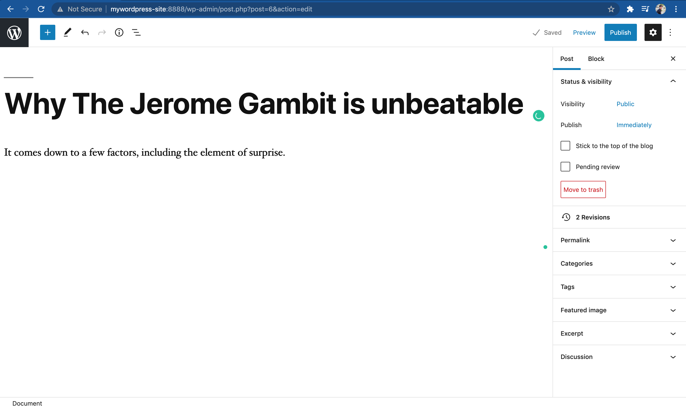

Klicka på **View Post**. Vi möts nu av vårt inlägg samt en väldigt konstig **url**

http://mywordpress-site:8888/2021/10/12/why-the-jerome-gambit-is-unbeatable/

Låt oss ändra på detta. Gå tillbaks till **admin**.

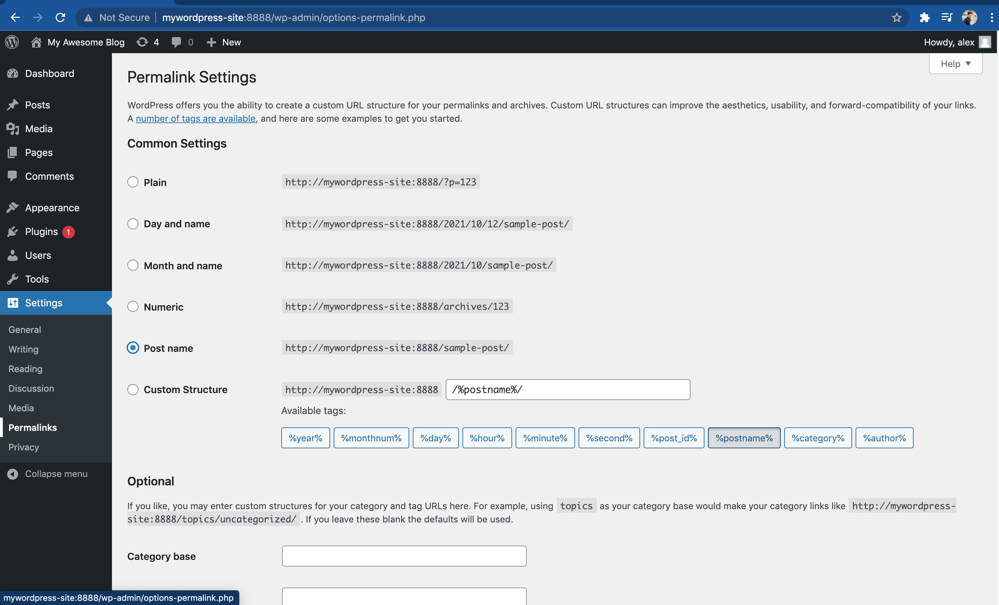

Ändra till **Post Name**. **Save Changes** och vi ska nu ha oss en 

