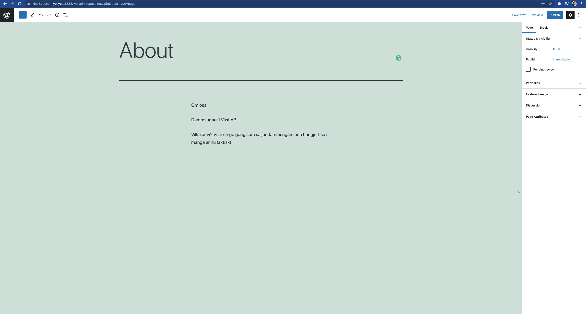

### CMS

CMS står för **Content Management System** och är helt enkelt ett sätt för oss att hantera (skapa, ändra, hantera) content. WordPress startade som en plattform för bloggar, men har nu växt till sig och är nu en renodlad CMS. 

Tanken bakom ett CMS är att personer utan det minsta teknisk erfarenhet i att skapa hemsidor ska kunna hantera innehållet, och till och med kunna designa hemsidan om den så vill.

Även om allt innehåll sparas i en databas, så kommer användaren aldrig, eller åtminstone väldigt sällan, att direkt arbeta mot databasen.

###### Identifiera de situationer då det är lämpligt att använda ett CMS-system

Tänk att du ska arbeta med ett projekt med följande kravspecifikation:

```
Kunden vill ha en hemsida som ska innehålla
- en sida som beskriver företaget
- en sida som beskriver företagets tjänster
	- varje tjänst ska ha sin egna sida
- sidan ska vara mobilresponsiv
- ett kontaktformulär

Kunden ska enkelt, på egen hand, kunna lägga till, ändra och ta bort innehåll på sidan. 
```

Hur går du tillväga?

Fundera kring de första punkterna.

```
- en sida som beskriver företaget
- en sida som beskriver företagets tjänster
	- varje tjänst ska ha sin egna sida
- sidan ska vara mobilresponsiv
- ett kontaktformulär
```

Utefter följande punkter kan vi använda oss av vårt personliga favorit framework, lägga till sidorna som ska vara med, använda oss av Bootstrap för att style:a och skapa en mobilresponsiv design och sen är vi färdiga.

Problemen kommer när vi läser den sista punkten

```
Kunden ska enkelt, på egen hand, kunna lägga till, ändra och ta bort innehåll på sidan.
```

Ett extremt (löjligt) exempel måhända, men här i ligger en stor fördel med att använda sig av ett CMS.

Hur ska kunden kunna ändra på innehållet? Kunden hade antingen behövt höra av sig till oss så att vi skulle kunna ändra i *source code* och därefter eventuellt *re-builda* applikationen. Detta är inget hållbart arbetssätt.

Även om vi hade kopplat applikationen mot en databas så ligger problemet i att låta användaren påverka innehållet, *decoupled* från oss och allt som har med kodande att göra.

CMS då? Kan det vara en lösning. Jepp, det kan det. 

Här är ett exempel på vår första naiva approach i React.

**about.js**

```javascript
import React from 'react'

const About = () => {
  return (
    <div>
      <h1>Om oss</h1>
      <h4>Dammsugare i Väst AB</h4>
      <p>Vilka är vi? Vi är en go gäng som säljer dammsugare och har gjort så i många år nu faktiskt</p>
    </div>
  )
}

export default About
```

Vill kunden ändra något i information som beskriver företaget, så är det här det måste göras. Manuellt.

Med hjälp av WordPress (i detta fall headless CMS) hade koden istället kunna sätt ut såhär(ta själva koden med en nypa salt):

```
import React, {useEffect, useState} from 'react'
import axios from 'axios';

const About = () => {

  const [data, setData] = useState(null)

  useEffect(() => {
    const fetchData = () => {
      const res = axios.get(
        '/wp-json/wp/v2/about'
      )
      const aboutData = res.json();
      setData(aboutData.data)
    }
    fetchData();
  })
  return (
    <div>
      <h1>{data.title}</h1>
      <h4>{data.subtitle}</h4>
      <p>{data.textContent}</p>
    </div>
  )
}

export default About
```

När vi får en request till /about kommer denna komponenten att renderas. När den renderas kommer vi göra skicka en http request till  /wp-json/wp/v2/about.

Vad som finns där:



Genom att använda sig av WordPress Admin-panel kan nu kunden ändra innehållet på sidan hur enkelt som helst.

Här har vi som sagt ett klokrent exempel på en situation där det är lämpligt att använda sig av ett CMS. Låt oss bryta ned vad CMS faktiskt gav oss:

- Vi som utvecklare behöver inte gå in och göra förändringar i koden efter att hemsidan levererats till kunden
- Användaren(kunden) behöver knappt ha datorvana för att kunna skapa innehåll till sin hemsida
- Vi kan fokusera på att style:a hemsidan då det mest tekniska (sätta upp en database) görs av WordPress automatiskt
- Kunden kan skapa flera användare för sitt team, så att flera personer kan gå in och göra ändringar eller lägga till innehåll
- Kunden har tillgång till hemsidan (adminpanelen) sålänge den har internetuppkoppling(via /wp-admin).
- Detta system är en win-win för bägge parter. 

**Så med nedbrytningen klar, vilka fler situationer finns där det är lämpligt att använda sig av ett CMS?**


###### Populära CMS-system

**Wordpress.org**

**HubSpot CMS Hub**

**Joomla**

**Drupal**

**Wix**

**Shopify**

###### Motivera när ett CMS-system ska användas

Okej, så vi har hittat några fördelar med att använda sig av ett CMS. Låt oss inte göra det svårare än det är. CMS kan med fördel användas om vi gör en hemsida åt en kund eller kompis som snabbt och enkelt vill kunna lägga till innehåll. 

Alltså hemsidor som är **content rich** med dynamiskt innehåll.

När ska det då inte användas?

https://agilemanifesto.org/

Behövs verkligen ett CMS här? 

```
© 2001, the above authors
this declaration may be freely copied in any form,
but only in its entirety through this notice.
```

Texten, och förmodligen layouten, har inte ändrats sedan 2001. Och jag tror inte att ambitionen finns där att sätta sig ned och snygga t den. Man är nog väldigt nöjda så. Med ett CMS tillkommer väldigt många filer, så att släppa runt på dessa kan i detta fall vara helt meningslöst.

#### 


