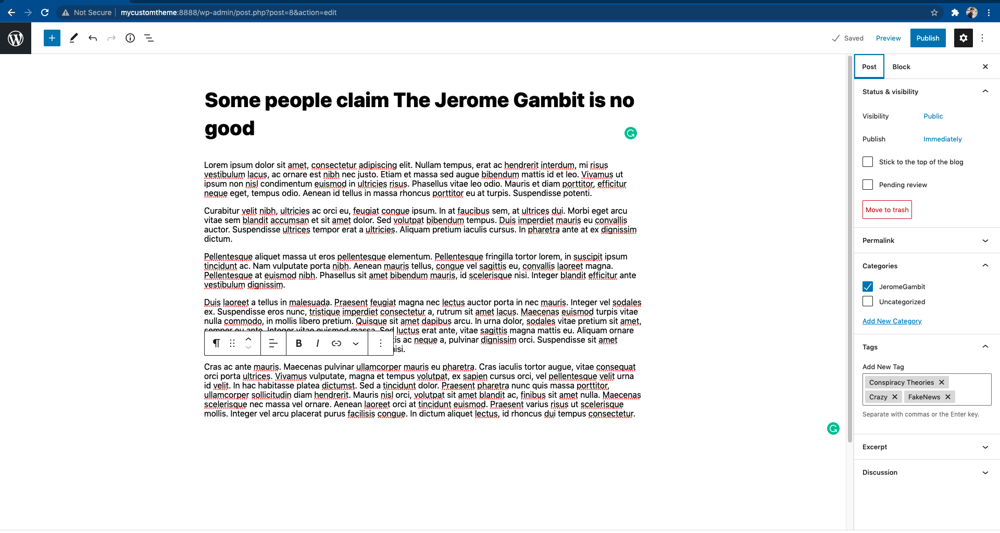
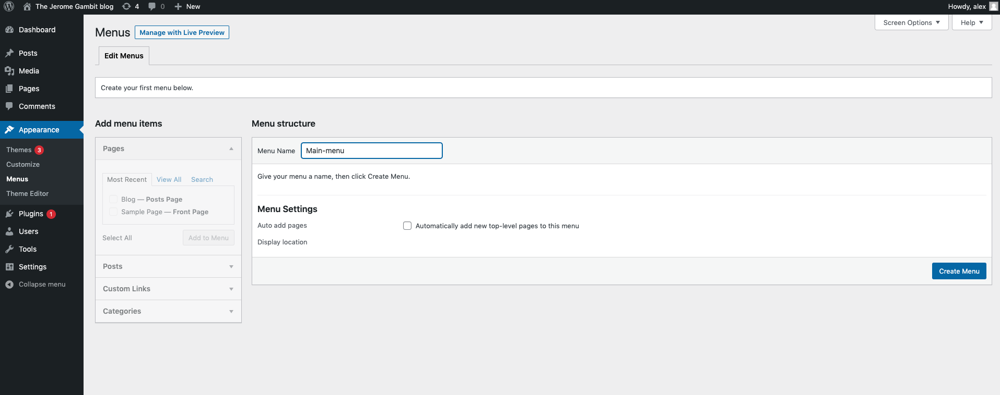
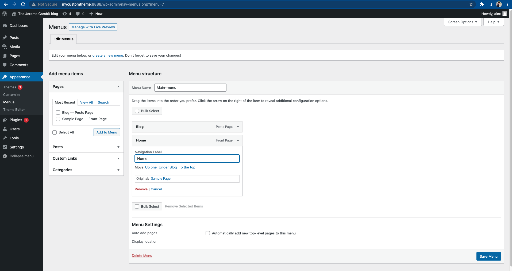
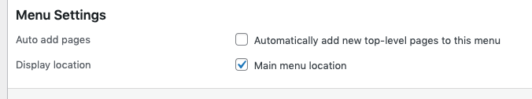
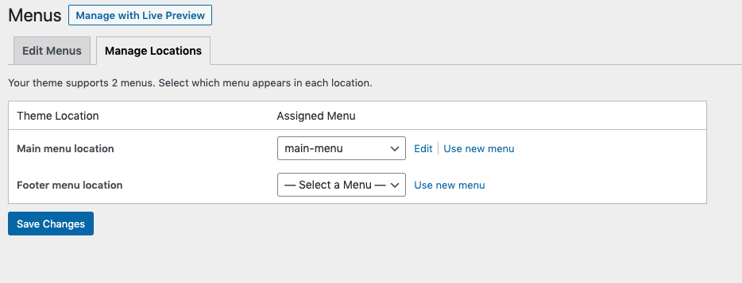
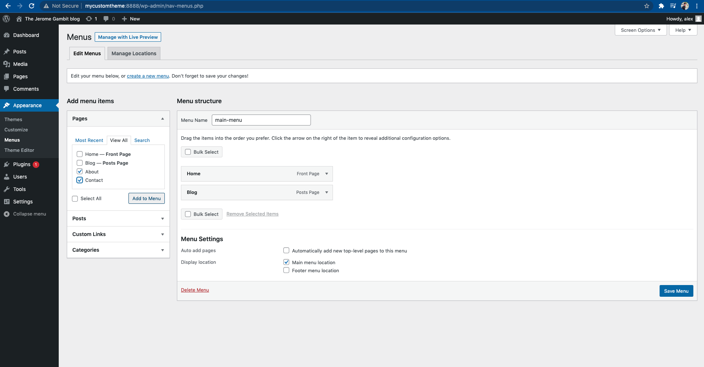
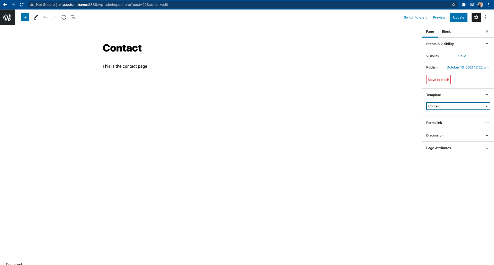

### Skapa ett eget WordPress-tema

https://codex.wordpress.org/Theme_Development

https://yoast.com/wordpress-theme-anatomy/

**1** 

Det ända vi egentligen behöver för att skapa ett WordPress-tema är **style.css** och **index.php**

**style.css**

```
/*
Theme Name: mycustometheme
Author: alex
Description: alex cool theme
Version: 1.0
License: GNU General Public License v2 or later
License URI: http://www.gnu.org/licenses/gpl-2.0.html
Tags: 
Text Domain: mycustometheme
*/

body {
    background-color: steelblue;
    color: salmon;
}
```

**index.php**

```
<!DOCTYPE html>
<html lang="en">
<head>
    <meta charset="UTF-8">
    <meta name="viewport" content="width=device-width, initial-scale=1.0">
    <meta http-equiv="X-UA-Compatible" content="ie=edge">
    <title>My Awesome Site</title>
    <link rel="stylesheet" href="/wp-content/themes/mycustomtheme/style.css">
</head>
<body>
<?php
echo "Hello World";
?>
</body>
</html>

```

Gå till /wp-admin.

Appearance->Themes->activate mycustomtheme

**2**

**header.php**

```
<!DOCTYPE html>
<html lang="en">
<head>
    <meta charset="UTF-8">
    <meta name="viewport" content="width=device-width, initial-scale=1.0">
    <meta http-equiv="X-UA-Compatible" content="ie=edge">
    <title>My Awesome Site</title>
    <link rel="stylesheet" href="/wp-content/themes/mycustomtheme/style.css">
</head>
<body>
```

**footer.php**

```
</body>
</html>
```

**index.php**

```
<?php
get_header();

echo "Hello World";

get_footer();
```

**get_header()** och **get_footer()** är exempel på **Template Tags**, vilket vi kommer att komma in på under steg 3.

Just dessa template tags gör det dom säger att dom gör; get the header från header.php och get the footer från footer.php.

**3**

Nu ska vi gå igenom **Template Files**.Templates är PHP source files som används för att generera sidor som användare *request:ar*. Dessa templates är uppbyggda av HTML, PHP och **WordPress Template Tags**. WordPress Template Tags används för att visa information dynamiskt. Det är kod som säger åt WP att göra eller hämta något.

**index.php**

```
<?php
get_header(); ?>

<h1><?php bloginfo('name'); ?></h1>

<?php
get_footer();
```

Om ni vill kan ni gå till **Admin** och ändra information i **Settings->General->Site Title**.

###### Template Hierarchy

https://developer.wordpress.org/themes/basics/template-hierarchy/

WP arbetar efter ett system när det kommer till templates som kallas för **Template Hierarchi**. Man försöker hela tiden att använda sig av den mest relevanta templaten, utifrån följanda aspekter:

1. Matches every query string to a query type to decide which page is being requested (for example, a search page, a category page, etc);
2. Selects the template in the order determined by the template hierarchy;
3. Looks for template files with specific names in the current theme’s directory and uses the **first matching template file** as specified by the hierarchy.


###### Front Page

1. `front-page.php` – Used for both “**your latest posts**” or “**a static page**” as set in the **front page displays** section of Settings → Reading.
2. `home.php` – If WordPress cannot find `front-page.php` and “**your latest posts**” is set in the **front page displays** section, it will look for `home.php`. Additionally, WordPress will look for this file when the **posts page** is set in the **front page displays** section.
3. `page.php` – When “**front page**” is set in the **front page displays** section.
4. `index.php` – When “**your latest posts**” is set in the **front page displays** section but `home.php` does not exist *or* when **front page** is set but `page.php` does not exist.

**page.php**

```
<?php
get_header(); ?>

	<h1>page.php is the The Front Page</h1>

<?php
get_footer();
```

Om vi kollar vår webbläsare nu så ser vi att det fortfarande är index.php som är används. 

4. `index.php` – When “**your latest posts**” is set in the **front page displays** section but `home.php` does not exist *or* when **front page** is set but `page.php` does not exist.

Gå in på Setting->Reading och ändra **Your homepage displays** till "A static page".

Nu möter vi följande kriteria:

3. `page.php` – When “**front page**” is set in the **front page displays** section.

**home.php**

```
<?php
get_header(); ?>

	<h1>home.php is the The Front Page</h1>

<?php
get_footer();
```

Ingen skillnad då vi inte möter något av följande kriteria:

2. `home.php` – If WordPress cannot find `front-page.php` and “**your latest posts**” is set in the **front page displays** section, it will look for `home.php`. Additionally, WordPress will look for this file when the **posts page** is set in the **front page displays** section.

**front-page.php**

```
<?php
get_header(); ?>

	<h1>Get out of the way, front-page.php is here</h1>

<?php
get_footer();
```

**4**

###### Template Folder and File Structure

Här är ett exempel på hur strukturen kan se ut i ett tema.

```
assets (dir)
      - css (dir)
      - images (dir)
      - js (dir)
inc (dir)
template-parts (dir)
      - footer (dir)
      - header (dir)
      - navigation (dir)
      - page (dir)
      - post (dir)
404.php
archive.php
comments.php
footer.php
front-page.php
functions.php
header.php
index.php
page.php
README.txt
rtl.css
screenshot.png
search.php
searchform.php
sidebar.php
single.php
style.css
```

**5**

###### The Loop

The Loop är en inbyggd teknik i WordPress som används för att visa upp posts.

Vi kan styra mycket av dess beteende. The Loop hämtar varje inlägg och formaterar det efter våra instruktioner. Vi kan använda The Loop till att:

- display post titles and excerpts on your blog’s homepage;
- display the content and comments on a single post;
- display the content on an individual page using template tags; and
- display data from [Custom Post Types](https://developer.wordpress.org/themes/functionality/pages-posts-custom-post-types/) and Custom Fields

Tänk nu att vi ska utveckla en blogg.

Vår filstruktur ser just nu ut såhär:

```
footer.php
front-page.php
header.php
home.php
index.php
page.php
style.css
```

Vad vi saknar är ett sätt att displaya **posts** aka våra blogginlägg.

Vårt mål är att när användare går in på www.example.com/blog så ska vi rendera våra blogginlägg.

Gå in på **admin**. Välj **Pages->Add new**. Skriv in "Blog" högst upp i editorn och välj **publish**.

Nu möts vi av "page.php is the The Front Page".

Gå in på **admin**. Välj **Posts->Add new**. Skriv in "Blog" högst upp i editorn och välj **publish**.



Notera att jag även har lagt till **Categories** och **Tags**.

Skapa några till posts så att vi har något att arbeta med.

Gå till **Settings->Permalinks** och välj **Post name**.

Gå till **Settings->Reading**->**Post page** och välj **Blog**.

**archive.php**

```
<?php
get_header();

if ( have_posts() ) :
	while ( have_posts() ) : the_post();
		the_title( '<h2>', '</h2>' );
		the_post_thumbnail();
		the_excerpt();
		?>
<a href="<?php echo the_permalink(); ?>">Link to Post</a> <?php

	endwhile;
else:
	_e( 'Sorry, no posts matched your criteria.', 'textdomain' );
endif;

get_footer();
```

**single.php**

```
<?php
get_header();
if ( have_posts() ) :
	while ( have_posts() ) : the_post();
		the_title( '<h1>', '</h1>' );
		the_content();
	endwhile;
else:
	_e( 'Sorry, no pages matched your criteria.', 'textdomain' );
endif;

get_footer();
```

**6**

###### Theme Functions

**functions.php** är var vi specificerar unika features i vårt tema.

Vi ska i denna fil nu göra tre saker:

1. Lägga till css
2. Lägga till support så att vi kan skapa en meny

**6.1** Lägg till CSS

Det anses vara av bästa praxis att ladda in CSS vi functions.php,  och inte i header.php som vi har det nu.

**functions.php**

```
<?php

function addStyleSheets():void {
	wp_enqueue_style('style', get_stylesheet_uri());
}

add_action('wp_enqueue_scripts', 'addStyleSheets');
```

**header.php**

```
<!DOCTYPE html>
<html lang="en">
<head>
    <meta charset="UTF-8">
    <meta name="viewport" content="width=device-width, initial-scale=1.0">
    <meta http-equiv="X-UA-Compatible" content="ie=edge">
    <title>My Awesome Site</title>
    <?php wp_head(); ?>
</head>
<body>
```

###### 6.2 Lägg till support för meny

**functions.php**

```
<?php

function addStyleSheets():void {
	wp_enqueue_style('style', get_stylesheet_uri());
}

add_action('wp_enqueue_scripts', 'addStyleSheets');

add_theme_support('menus');
```

Gå till **Admin** -> **Appearance**->**Menus**

Skapa en ny meny.





**functions.php**

```
<?php

function addStyleSheets():void {
	wp_enqueue_style('style', get_stylesheet_uri());
}

add_action('wp_enqueue_scripts', 'addStyleSheets');


register_nav_menus(
	array(
		'main-menu' => 'Main menu location',
		'footer-menu' => 'Footer menu location'
	)
);
```

Gå till **Admin** -> **Appearance**->**Menus**





**header.php**

```
<!DOCTYPE html>
<html lang="en">
<head>
    <meta charset="UTF-8">
    <meta name="viewport" content="width=device-width, initial-scale=1.0">
    <meta http-equiv="X-UA-Compatible" content="ie=edge">
    <title>My Awesome Site</title>
    <?php wp_head(); ?>
</head>
<body>
<header>
    <?php
    wp_nav_menu(
            array(
                    'theme_location' => 'main-menu'
            )
    )
    ?>
</header>
```

**style.css**

```
/*
Theme Name: mycustometheme

Author: alex
Description: alex cool theme
Version: 1.0
License: GNU General Public License v2 or later
License URI: http://www.gnu.org/licenses/gpl-2.0.html
Tags:
Text Domain: mycustometheme
*/

html, body, div, span, applet, object, iframe,
h1, h2, h3, h4, h5, h6, p, blockquote, pre,
a, abbr, acronym, address, big, cite, code,
del, dfn, em, font, img, ins, kbd, q, s, samp,
small, strike, strong, sub, sup, tt, var,
dl, dt, dd, ol, ul, li,
fieldset, form, label, legend,
table, caption, tbody, tfoot, thead, tr, th, td {
    margin: 0;
    padding: 0;
    border: 0;
    outline: 0;
    font-weight: inherit;
    font-style: inherit;
    font-size: 100%;
    font-family: inherit;
    vertical-align: baseline;
}
/* remember to define focus styles! */
:focus {
    outline: 0;
}
body {
    line-height: 1;
    color: black;
    background: white;
}
ol, ul {
    list-style: none;
}
/* tables still need 'cellspacing="0"' in the markup */
table {
    border-collapse: separate;
    border-spacing: 0;
}
caption, th, td {
    text-align: left;
    font-weight: normal;
}
blockquote:before, blockquote:after,
q:before, q:after {
    content: "";
}
blockquote, q {
    quotes: "" "";
}


.main-menu {
    padding: 20px;
    display: flex;
    background-color: black;
}

.main-menu ul {
    display: flex;
}

.main-menu li a{
    color: white;
    text-decoration: none;
    margin-left: 10px;
    font-weight: bold;
}

.main-menu li a:after{
    text-decoration: none;
    margin-left: 10px;
    font-weight: bold;
}
```

Jag la till några **reset** egenskapar tagna från http://meyerweb.com/eric/thoughts/2007/05/01/reset-reloaded/.

I övrigt kan ni se relationen mellan menu_class i **functions.php** och **.main-menu** i style.css.


**7**

Att arbeta med olika sidor med hjälp av template_part().

Skapa filer så att du har följande filstruktur

```
archive.php
front-page.php
index.php
page.php
single.php
404.php
style.css
includes (directory)
	section-content.php
```

**404.php**

```
<?php
get_header(); ?>

	<h1>Page not found!</h1>

<?php
get_footer();
```

404.php finns till när användare requestar en sida som inte finns.

###### get_template_part()

Loads a template part into a template.

**front-page.php**

```
<?php
get_header(); ?>

	<h1><?php the_title() ?></h1>
  <?php get_template_part('/includes/section','content'); ?>

<?php
get_footer();
```

**includes/section-content.php**

```
<?php

echo "Hello from section-content";
```

Vårt mål nu är att bygga vidare på denna fil. Vi vill hämta info från Admin och visa upp istället för bara ett simpelt hello.

```
<?php

if( have_posts() ) : while( have_posts() ): the_post();?>
	<?php the_content() ?>
<?php endwhile; else: endif;?>
```

I **Admin** skapa två nya **Pages**: About och Contact. Lägg därefter till dem till menyn.



**page.php**

```
<?php
get_header(); ?>

	<h1><?php the_title() ?></h1>
	<?php get_template_part('/includes/section','content'); ?>
<?php
get_footer();
```

**8**

Template för enskild sida.

Skapa en fil som heter **template-contact.php**

```
<?php
/*
 Template Name: Contact
 */
echo "This is my custom template I can use for any Page";
```




Välja Template: Contact och tryck på **update**.

